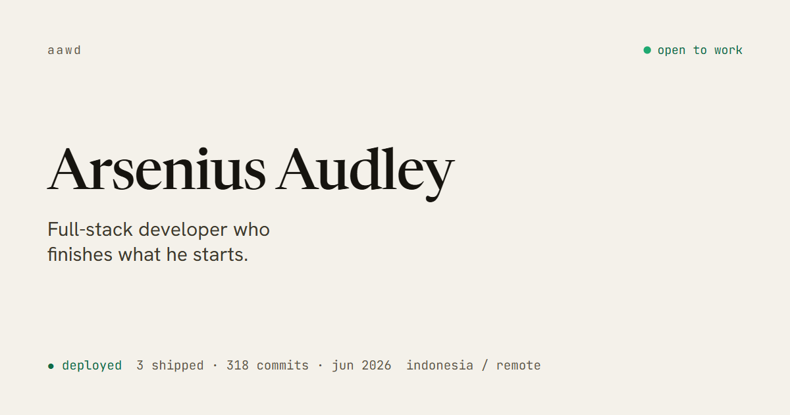

# Arsenius Audley — Developer Portfolio

> Full-stack developer who finishes what he starts.

**Live:** [arsenius-audley.vercel.app](https://arsenius-audley.vercel.app)



A personal portfolio built around one idea: prove "ships complete things end-to-end" by *showing*
it. The homepage opens with a **Ship Log** — a deploy timeline rendered from real git commits — and
each case study is told as a `problem → build → ship → result` story with the project's actual commit
trail.

## Stack

- **Vite + React 18** (plain JavaScript, no TypeScript) · **React Router**
- **Tailwind CSS v4** with a CSS-variable design-token system
- **Motion** for component interactions · **GSAP + ScrollTrigger** for the scroll-driven build sequences
- **react-helmet-async** for per-route SEO · **lucide-react** icons
- **Vitest + Testing Library** for logic tests · **Playwright / Lighthouse** for visual + quality checks

## Highlights

- A signature **Ship Log** built from real commit data (`src/data/shiplog.json`)
- An accessible **⌘K command palette** (roving focus, full keyboard support)
- Scroll-driven case-study build sequences that respect `prefers-reduced-motion`
- A working contact form (Web3Forms) with a `mailto:` fallback and accessible validation
- Lighthouse **100** on accessibility, best practices, and SEO; Core Web Vitals: LCP ~0.25s, CLS 0

## Getting started

```bash
npm install
npm run dev        # http://localhost:5173
npm run build      # production build → dist/
npm run preview    # serve the production build
npm test           # run the test suite
npm run images     # regenerate optimized WebP from .raw-images/ (needs sharp)
```

Requires Node 20+.

## Project structure

```
src/
  routes/      Home, Work, CaseStudy, About, Contact, NotFound
  components/  layout/ (header, footer, command palette) · work/ · shiplog/ · primitives/
  data/        profile, projects, experience, shiplog.json   ← edit content here
  styles/      tokens.css (design tokens) · base.css
  lib/ hooks/  helpers and reusable hooks
public/work/   optimized project screenshots
```

All copy and project data live in `src/data/`. Colors, type, and spacing live in `src/styles/tokens.css`;
nothing hardcodes a hex value outside it.

## Contact form

The form posts to [Web3Forms](https://web3forms.com) (no backend). Without a key it falls back to a
`mailto:` link, so it always works. To enable real email delivery:

1. Create a free access key at [web3forms.com](https://web3forms.com) (it's emailed to you).
2. Add it to `.env`:
   ```bash
   VITE_WEB3FORMS_KEY=your-access-key
   ```
3. Add the same variable in your Vercel project settings (Environment Variables) for production.

## Deployment

Deployed to Vercel. `vercel.json` handles SPA routing (all paths rewrite to `index.html`).

```bash
vercel          # preview deployment
vercel --prod   # production
```
